# open-fo-algo-zerodha-nifty
 An open source algorithmic trading platform for Nifty F&amp;O - Buying &amp; Selling, leveraging candlestick/chart patterns, pivot analysis, and real-time risk management. It integrates with Zerodha Kite Connect for execution.

 This design ensures that the trading system is efficient, adaptable, and reliable, providing a robust framework for automated options trading on the Nifty index.

### **1.1 Key Features**
- 50+ candlestick/chart pattern detection
- Config-driven risk management
- Virtual trading environment
- Multi-timeframe trend analysis
- Automated position management
- Real-time Telegram notifications
- Resumes function to start from where it left

---
### **1.2 How to Run System?**
- Required: Linux, Python Environment and Kite Connect API access
 1. Config.json - Update Zerodha Connect API Key and Secret obtain from Zerodha Connect API platform
 2. Config.json - Check and update your risk management rules like position and rules sections
 3. Config.json - selling to true for selling or false for buying
 4. Config.json - virtual_env to false in live or true in virtual running
 5. /init.sh - to start trading!
- That's it you can see automatically system does analyze live data and take trades Nifty F&O buying or selling automatically and manages to be in profitable in most controled manner.
---

### **1.3 System Live in running**


### **1.3 Telegram Live reporting**


### **1.4 System results so far**


## **2. Architecture**
### **2.1 System Sequence Diagram

```mermaid
sequenceDiagram
    %% Color Definitions
    participant User #ff9f40
    participant MainApp #4db6ac
    participant KiteAPI #6c5ce7
    participant WebSocketManager #2d3436
    participant OHLCProcessor #e17055
    participant SignalEngine #00b894
    participant PositionManager #55efc4
    participant RiskMonitor #d63031
    
    User->>MainApp: 🚀 Start Application
    activate MainApp #74b9ff
    MainApp->>KiteAPI: 🔑 Initialize Connection
    KiteAPI-->>MainApp: ✅ Authentication Status
    MainApp->>KiteAPI: 📜 Fetch Historical Data
    KiteAPI-->>MainApp: 📊 OHLC Data
    MainApp->>OHLCProcessor: 📈 Calculate EMAs
    MainApp->>WebSocketManager: 📡 Start WS Connection
    WebSocketManager->>KiteAPI: 🔗 Connect WS
    KiteAPI-->>WebSocketManager: 🟢 Connection ACK
    deactivate MainApp
    
    loop 🔄 Tick Processing
        WebSocketManager->>OHLCProcessor: 📨 New Tick
        activate OHLCProcessor #fab1a0
        OHLCProcessor->>OHLCProcessor: 🕒 Update 5min Candle
        OHLCProcessor->>SignalEngine: 🚦 Candle Ready
        deactivate OHLCProcessor
        
        activate SignalEngine #55efc4
        SignalEngine->>SignalEngine: 🔍 Detect Patterns
        SignalEngine->>RiskMonitor: 📊 Validate Entry
        deactivate SignalEngine
        
        activate RiskMonitor #ff7675
        alt ✅ Valid Entry
            RiskMonitor->>PositionManager: 💹 Execute Trade
            PositionManager->>KiteAPI: 📩 Place Order
            KiteAPI-->>PositionManager: 🟢 Order Status
        end
        deactivate RiskMonitor
        
        PositionManager->>RiskMonitor: 👀 Monitor Position
        activate RiskMonitor #ff7675
        alt 🚨 Exit Condition
            RiskMonitor->>PositionManager: 🛑 Close Position
            PositionManager->>KiteAPI: 📩 Exit Order
        end
        deactivate RiskMonitor
    end
    
    User->>MainApp: ⚡ Shutdown
    activate MainApp #74b9ff
    MainApp->>PositionManager: 🧹 Close All
    MainApp->>WebSocketManager: 🔌 Disconnect
    deactivate MainApp
```

### **2.2 Technology Stack**
| Component          | Technology                 |
|---------------------|---------------------------|
| Core Engine         | Python 3.10+              |
| Data Processing     | Pandas 2.0, NumPy 1.24    |
| Broker Integration  | Kite Connect API v3        |
| Pattern Detection   | Custom `rf_patterns.py`    |
| Configuration       | JSON + Fernet Encryption   |
| Notifications       | Telegram Bot API          |

---
The Nifty Options Selling Algorithm is a comprehensive trading system designed to automate the process of selling options on the Nifty index using the Kite Connect API. Below is an explanation of the design and each function, along with the flow of operations:

### Design Overview

The system is designed to handle real-time data, manage positions, execute trades, and ensure robust risk management. It incorporates various technical indicators and patterns to identify optimal entry and exit points. The architecture includes components for configuration, data handling, position management, risk management, logging, and notifications.

### Key Components and Functions

1. **Configuration and Initialization**
   - **ConfigLoader**: Loads and validates the configuration from a JSON file.
   - **KiteManager**: Initializes the Kite Connect API using the provided API key and access token.
   - **ColoredLogger**: Configures the logging system with colored output for better readability.

2. **Data Handling**
   - **WebSocketManager**: Manages WebSocket connections for real-time market data updates.
   - **fetch_historical_ohlc**: Fetches past 5-minute OHLC data to backfill when the script starts late.
   - **update_ohlc**: Maintains 5-minute OHLC data with EMAs using Kite ticker timestamps.

3. **Technical Analysis**
   - **detect_pivot_reversal**: Detects reversal signals at pivot levels with price action and volume confirmation.
   - **detect_day_high_low_reversal**: Detects failed breakout and reversal patterns.
   - **detect_gap**: Detects gap-up or gap-down based on a threshold percentage.
   - **analyze_gap_sustainability**: Analyzes gap-up or gap-down sustainability using the current price.
   - **get_trend_from_ohlc**: Determines the trend (Uptrend, Downtrend, Sideways) using EMA values.
   - **calculate_daily_levels**: Calculates previous day's levels and pivot points.

4. **Position Management**
   - **position_load_open**: Loads open positions from Kite.
   - **position_entry_conditions**: Checks all entry conditions with pattern confirmation.
   - **position_open**: Executes trades with premium-based strike selection.
   - **manage_position**: Manages open positions, including stop-loss, target, and trailing stop-loss.
   - **position_close**: Closes the current position.
   - **position_close_margin_all**: Closes all margin options (buy positions for CE & PE).

5. **Risk Management**
   - **Global Variables**: Tracks virtual profits, positions, and consecutive SL hits.
   - **Risk Rules**: Implements profit lock, cooldown periods, and dynamic lot sizes based on MTM.

6. **Logging and Notifications**
   - **telegram_notify**: Sends trade updates and system notifications via Telegram.
   - **update_terminal**: Updates the terminal with real-time position and market data.

7. **Graceful Shutdown**
   - **exit_system**: Ensures proper closure of positions and resources on system exit.
   - **signal_handler**: Handles system signals for graceful shutdown.

### Efficiency and Benefits

- **Real-Time Data Handling**: Ensures up-to-date market information for accurate decision-making.
- **Dynamic Position Management**: Adapts to market conditions to maximize profits and minimize losses.
- **Risk Management**: Implements robust risk management strategies to protect capital and preserve gains.
- **Automated Notifications**: Keeps users informed about trade activities and system status in real-time.
- **Graceful Shutdown**: Ensures that the system exits cleanly, preserving data and resources.
---
### Blueprint

## **3. Configuration Management (`config.json`)**
### **3.1 Structure**
```json
{
    "kite": {
        "api_key": "encrypted_value",
        "access_token": "encrypted_value"
    },
    "system": {
        "nifty_token": 256265,
        "virtual_env": true,
        "telegram": {
            "bot_token": "ENV:TELEGRAM_TOKEN"
        }
    },
    "rules": {
        "risk": {
            "lot_size": 300,
            "stop_loss": 10,
            "profit_lock": {
                "active": true,
                "max_sl_hits": 2
            }
        }
    }
}
```

---

## **4. Pattern Detection Engine (`rf_patterns.py`)**
### **4.1 Candlestick Patterns**
| Category           | Bullish Patterns                      | Bearish Patterns                    |
|---------------------|---------------------------------------|-------------------------------------|
| **Single Candle**   | Hammer, Morning Doji                  | Shooting Star, Gravestone Doji      |
| **Multi-Candle**    | Three Soldiers, Bullish Engulfing     | Three Crows, Bearish Harami         |
| **Confirmation**    | Tweezer Bottom, Piercing Line         | Tweezer Top, Dark Cloud Cover       |

### **4.2 Chart Patterns**
| Pattern Type       | Detection Method                      | Confirmation Criteria               |
|---------------------|---------------------------------------|-------------------------------------|
| Head & Shoulders   | Peak analysis with 3 maxima           | Neckline breakout + volume surge    |
| Double Top/Bottom  | Price rejection at same level         | Support/resistance break            |
| Flags/Pennants     | Volume contraction + parallel trends | Breakout direction validation        |

---

## **5. Risk Management Framework**
### **5.1 Multi-Layer Protection**
# Algorithm controlled risk and position management

```mermaid
graph TD;
    A(["🏁 Start"]) -->|Check Price| B{{"🔴 Price >= SL?"}}
    B -->|Yes| C(["❌ Exit Position: SL Hit"])
    C --> D(["⬆️ Update SL Counter"])
    D -->|SL Consecutive Hits Max?| E{{"❌ Exit System"}}

    B -->|No| F{{"🟡 Price <= 50% Target?"}}
    F -->|Yes| G(["✅ Set BESL = Entry Price"])
    
    F -->|No| H{{"🟢 Price <= Target?"}}
    H -->|Yes| I(["✅ Set TSL = Target + Trailing Threshold"])
    I --> J(["🔄 Adjust Target = Target - Config Target"])
    
    H -->|No| K{{"🟠 Price <= TSL & 50% of New Target?"}}
    K -->|Yes| L(["🔽 Move TSL Down"])
    
    K -->|No| M{{"🔵 Price >= TSL?"}}
    M -->|Yes| N(["🚀 Exit Position: TSL Hit"])
    
    M -->|No| O{{"⚪ Price >= BESL?"}}
    O -->|Yes| P(["🚀 Exit Position: BreakEven Hit"])

    O --> Q{{"🟢 Profit Threshold Reached?"}}
    Q -->|Yes| R(["🔒 Activate Profit Lock"])
    
    Q -->|No| S{{"🔴 Loss Threshold Reached?"}}
    S -->|Yes| T(["❌ Exit System"])
    
    P --> U(["📈 Continue Trading"])
    R --> U
    T --> X(["🛑 System Stops"])
```


---

## **7. Monitoring & Reporting**
### **7.1 Key Metrics**
| Metric                | Calculation                          | Alert Threshold |
|-----------------------|--------------------------------------|-----------------|
| Win Rate              | (Winning Trades / Total) × 100       | <55%            |
| Profit Factor         | Gross Profit / Gross Loss            | <1.2            |
| Max Drawdown          | Peak-to-Trough Decline               | >8%             |

### **7.2 Sample Telegram Alert**
```
[RF] ENTRY: NIFTY23JUL19500CE
Pattern: Hammer + Pivot Reversal
Entry Price: 132.50 | Qty: 300
SL: 122.50 (7.5%) | Target: 152.50
Current P&L: +2,150 (1.6%)
```

---

## **8. Security Architecture**
### **8.1 Access Control**
| Resource             | Permission Level       | Authentication Method     |
|----------------------|------------------------|---------------------------|
| Kite API             | Trade+Data             | OAuth 2.0 + IP Whitelist  |
| Telegram Channel     | Read-only              | JWT Token                 |
| Config Storage       | Admin-only             | KMS + IAM Policy          |

---
